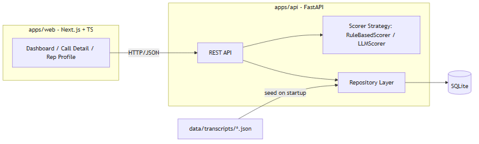
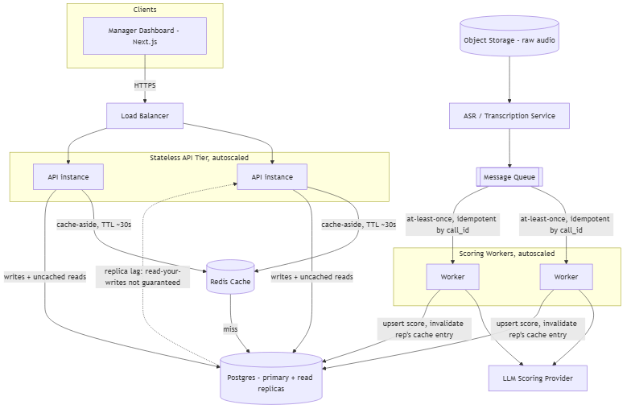

# Sales Call Coaching Insights
### Rilla On-Site Build - Reference Presentation

---

## The Problem

Sales managers can't sit in on every rep's conversation. Coaching today
relies on slow, subjective spot-checks. This tool turns every transcribed
call into an objective scorecard, at scale.

---

## Product Walkthrough

1. **Leaderboard** - reps ranked by average call score, linking to each rep
2. **Call Detail** - transcript and scorecard side by side
3. **Rep Profile** - score trend over time, linking to each call
4. **All Calls** - browse every call across reps

*(live demo here)*

---

## Architecture (MVP)

- Next.js/TypeScript frontend
- FastAPI backend, SQLite storage
- `Scorer` interface (Strategy pattern): `RuleBasedScorer` default, pluggable
  `LLMScorer`

---

## Key Decisions & Trade-offs

- **SQLite over Postgres** - zero setup for a 4-hour build; swappable later
- **Deterministic scoring first** - testable, reproducible, no API-key
  dependency; LLM scoring is an additive path, not a requirement
- **Two services, not one monolith** - mirrors how this would actually
  scale: frontend and scoring logic evolve independently

---

## Design Patterns Used

- **Strategy** - `Scorer` interface, `RuleBasedScorer` / `LLMScorer`
- **Repository** - DB access isolated behind SQLAlchemy models
- **Factory** - `get_scorer()` picks implementation from `SCORER_BACKEND` env

---

## Independent Review & Hardening

Built with AI assistance, then independently reviewed - the implementing
agent's own "all green" self-review missed all of this.

- 8-angle automated review + manual verification -> **20 confirmed findings**
  (invalid-JSON scoring value, zero navigation links, keyword
  false-positives in scoring, N+1 queries, a silent scorer fallback)
- Every fix: failing test -> fix -> passing test -> commit, same discipline
  as the original build
- One regression test caught a **real pre-existing bug**, not something the
  review itself introduced

*Passing tests and a clean type-check are necessary, not sufficient.*

---

## Known Limitations

- Transcripts are pre-provided text - no ASR/audio pipeline
- No auth/multi-tenancy - single manager view
- Keyword-based scoring misses nuance an LLM or trained model would catch
- No `scorer_version` - a scoring-logic fix doesn't retroactively apply to
  already-scored calls without a backfill job
- No pagination on `/api/reps` / `/api/calls` - fine at demo scale only

---

## Production / Scale Architecture

- Audio -> ASR -> queue -> autoscaled workers (idempotent upsert by `call_id`)
- Postgres + read replicas; Redis cache-aside w/ write-time invalidation
- Stateless, autoscaled API tier, multi-AZ, paginated list endpoints
- Multi-tenant auth/RBAC, encryption, defined retention/deletion policy
- Graceful degradation: LLM failure falls back to rule-based scoring

*Tradeoffs (replica lag, cache staleness) detailed in `design/architecture.md`.*

---

## Roadmap

1. Real ASR integration
2. Multi-tenant auth
3. Production LLM scorer with human-in-the-loop review
4. Real-time ingestion and alerting
5. CRM integrations
6. `scorer_version` field + backfill job for retroactive scoring fixes
7. Pagination on list endpoints before scaling past the demo dataset
8. Transcript retention/deletion policy before storing real customer data

---

## Q&A

Appendix: API reference and data model in `design/architecture.md`.
